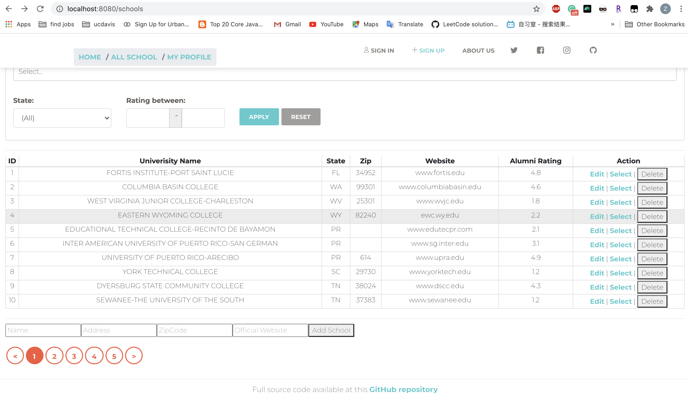
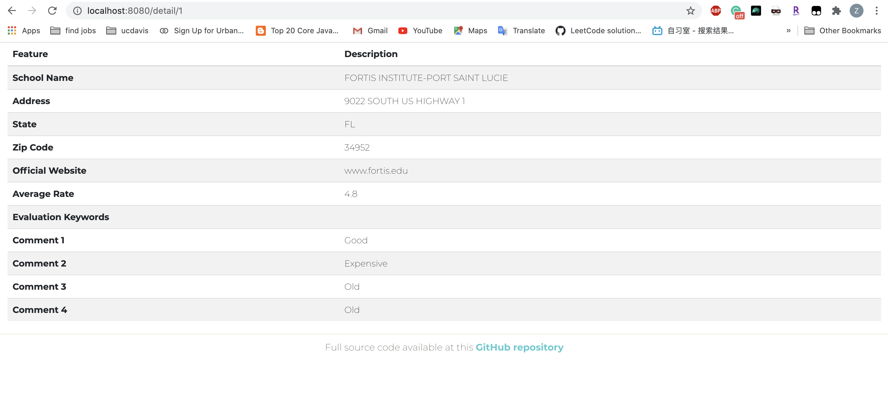
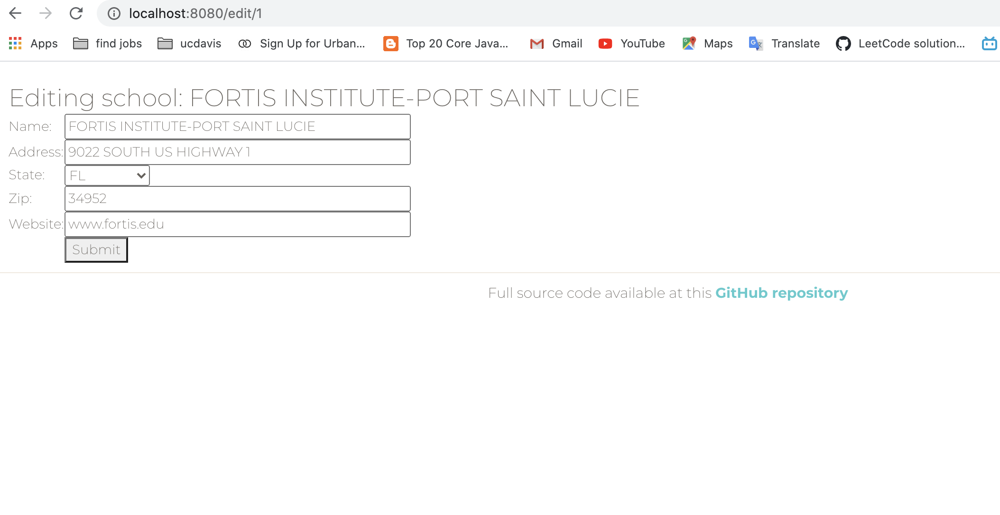

Group project UI by team : WDX Repo link to API: https://github.ccs.neu.edu/NEU-CS5610-SU20/GroupProject_WDX_API.git

## Project Introduction and Development Progression:
Our App Alumni's Insight is designed for users to fetch the school evaluations from the school alumni. Our App structure is referred to our TextBook and IssueTracker APP.

### Iteration 2.0
This week we implemented App Register/login, user profile and comments management. 
1. After registration, user can login and maintain his "signIn" state for an hour. The jwt token is stored in local storage and will be expired after an hour.
2. Create a new collection to manage user comments.
3. User can fetch his personal information, update his personal information and see his comments history.
4. Heroku ui: https://new-app-ui1.herokuapp.com/

### Iteration 1.0
The App pages and functions include:
- Home landing page

- User registration/log in (will be implemented at Iteration 2.0)
- User profile (will be implemented at Iteration 2.0)
- School list page with search and filter functionalities (Done)

- School details (Done)

- School Information Edit (Done)

- School Evaluation, including rating and write comments (Partially done, api has been established. Will be achieved at Iteration 2.0)

## Team Member:
Mi Tang, Zihan Xiao\
Member contributions can be find in Dev logs.

## APP UI Installation and running instruction
1. Installation: under ui work directory, run `npm install`.
2. Running: run `npm run compile` then `npm start`. App will be run at http://localhost:8080 .

## Development logs
Aug 10 by Zihan
1. Modify ui design.
2. Change alert method and abort Toast.
3. Deploy App on heroku.

Aug 10 by Mi Tang
1. Admin navbar and user navbar conflicts solved.
2. Heroku deployment trial.

Aug 9 by Zihan
1. Implemented access authorization management.
2. Fix navigation bar errors.

Aug 9 by Mi Tang
1. Sucessfully use login state to control rendering of userprofile page, and user will be able to update his comment and personal info.
2. Complete comment add part, when user add new comment to school, comment database records both userID and schoolID, so user could view his submitted comment from his profile.

Aug 8 by Mi Tang
1. User database update function implemented. Only admin could update user database.

Aug 7 by Mi Tang
1. Set PORT so codes work both for heroku and local.

Aug 6 by MiTang
1. Impelemented user profile update function (8080/profile/$(id)) including updating personal info and school review info, with manually setting userID and schoolID. Will continue on get userID from login information.
Aug 5 By MiTang
1. Fixed function to show comments only related with school on school detail page.
2. Use react-bootstrap to pretify comment submit interface.

Aug 4 By MiTang
1. Redefined comment databases, school databases and user databases along with graphql schema to relate commentID to schoolID and userID.
2. Implemented add comment function to related school under school detail page. Comment is able to added to specific schools but not identified as specific user yet. 
3. Each school detail page nows shows a full-list of comments. Need to show only related comments. Will continue to do. 

Aug 3 By Zihan
1. Implemented Auth, JWT authentication and register functionality.

August 3rd by MiTang
1. Buildup Admin page login and to connect with Users database, comment databases and university databases.

August 2nd by MiTang

1. Seprate visitor page and admin page for school list. Visitor page are only allowed to view and click for detail information. Filters, hide view, sorting and search functions all supplied. Admin page for school list has access to edit, delete and add schools, but view detail function is not necessry so is canceled.
2. Fixed connection links between navigation and pages.

August 1st by MiTang
1. `npm install react-bootstrap-table` Build SchoolVisitPage with react-bootstrap-table for non-admin user visit

July 31 By Zihan
1. Correct bugs in filter.

July 30 by Zihan
1. Correct StateType in SchoolAdd.
2. Update comments display in SchoolDetails.

July 29, 2020 by Mi Tang
1. Pretify UI by modifying bootstrap property
2. Home, All School, My Profile link connected.
3. 'State' filter applied.
4. Modified webpack config to get rid of warnings.
5. npm install -D @svgr/webpack to show icon
6. Changed package.json,
7. npm install --save-dev style-loader css-loader

July 29, 2020 by Zihan
1. Finished SchoolEdit.jsx. Modified SchoolAdd.jsx and SchoolSearch.jsx.
2. Add plugin in webpack.config.js
3. Corrected table head in SchoolList Page.

July 28, 2020 by Mi Tang
1. `npm install file-loader --save-dev ` to allow webpack read jpg files
2. `npm install gulp --save-dev` to use gulp
3. `npm install gulp-sass --save-dev` to use sass
4.  Remove server rendering, follows layout of Pro-MERN-Stack chap11.

July 27, 2020 by Zihan
1. There exist some problems in router. For example, when click "select" in school list page, the page redirect to "localhost:<port>/detail/id" but the school detail data does not return as expect (which return "School ${id} dose not found). However, if refresh that page, school description shows as expected.
2. Similar problems shows when click "Back Button" in the browser.